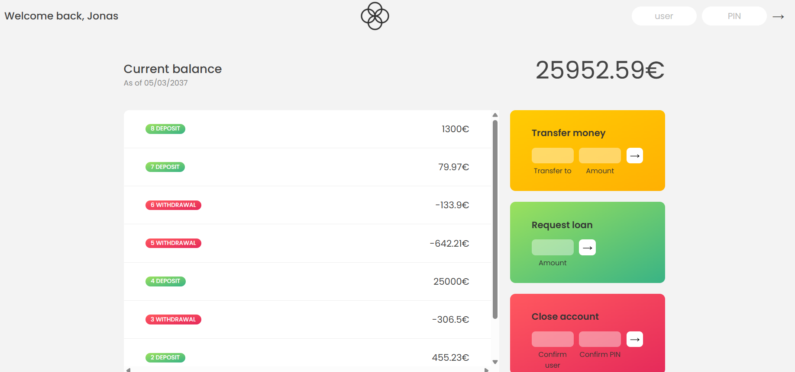

# Bankist App  

A **JavaScript mini project** simulating a simple banking application.  
This project is built with **HTML, CSS, and Vanilla JavaScript**, aiming to practice core and intermediate JavaScript concepts (DOM, events, arrays, methods, etc.).  

---

## ✨ Features  

- Display account balance  
- View transaction history (deposits / withdrawals)  
- Transfer money to another user  
- Request a loan  
- Close an account  
- Simple login with username and PIN  

---

## 🛠️ Technologies  

- **HTML5** – Page structure  
- **CSS3** – Styling and UI design  
- **JavaScript (ES6+)** – Application logic and interactivity  

---

## 📂 Project Structure  

```
project-folder/
│── index.html
│── style.css
│── script.js
│── README.md
```

---

## 🚀 How to Run  

1. Clone the repository:  
   ```bash
   git clone https://github.com/Taha-Afzali-DP/Bankist.git
   ```  
2. Navigate to the project folder:  
   ```bash
   cd Bankist
   ```  
3. Open `index.html` in your browser.  

---

## 🎯 Learning Goals  

This project is designed to practice the following:  
- Working with the DOM and events  
- Common array methods (map, filter, reduce, find, some, every, sort)  
- Formatting numbers and dates  
- Simple state management in an app  

---

## 📸 Preview  

  

---

👨‍💻 Project Owner: **Taha-Afzali-DP**
